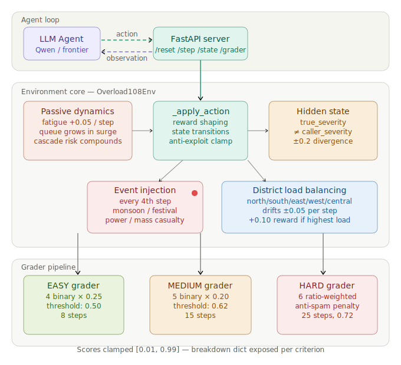

<div align="center">
  
</div>

<br>

## ⯈ Live Demo
<div align="center">
  
  <p><i>High-stakes HARD task simulation: MASS CASUALTY + MONSOON SURGE</i></p>
</div>

<br>


<div align="center">
  
  
  
  
  
</div>

<br>

Most RL environments test if an agent can solve a problem. **108-Overload tests if an agent can save lives under impossible constraints.**

India's 108 emergency ambulance service handles **94,000+ calls per day**, responds to **39,000 emergencies daily**, and rescues **800+ lives every single day**. During monsoon surges, festival stampedes, and mass-casualty events, operators face cascading failures with limited ambulances, exhausted staff, and patients deteriorating by the second. This environment simulates that exact high-stakes dispatch problem as a deterministic OpenEnv for the Meta × Hugging Face × Scaler Hackathon.

---

## ⎔ At a Glance

| Item | Value |
| :--- | :--- |
| Environment ID | `overload_108` |
| Tasks | `EASY` · `MEDIUM` · `HARD` |
| Hidden state | `true_severity` (agent cannot observe) |
| Passive decay | `operator_fatigue` +0.05 every step |
| Anti-spam | Score penalty if any action > 40% of trajectory |
| Grader scores | Bounded `[0.01, 0.99]`, breakdown dict exposed |
| Exploit fix | Feedback capped at 400 chars |
| Spec | OpenEnv v1.0, FastAPI, Docker, HF Space |

---

## ❖ Architecture



## ✦ Why This Matters

India's 108 service operates at a scale most people don't grasp:
- **94,000+** emergency calls processed every single day
- **800+ lives rescued daily** — that's one life every 2 minutes
- During monsoon season, call volume spikes 3× with half the road capacity and frequent power outages disrupting dispatch centers
- Operator fatigue and poor triage decisions during mass-casualty events directly correlate with preventable deaths

No existing OpenEnv environment models this. Email triage, bug triage, incident routing — these exist. A simulator where every hesitation passively costs lives, where the caller lies (panic distorts reported severity), and where one wrong dispatch cascades city-wide — this doesn't. **108-Overload is built for that gap.**

## ⟡ How It's Different

- **Hidden State (Information Asymmetry):** The agent sees `caller_severity_vector` — what the panicked caller *reports*. The environment tracks `true_severity` — what the patient *actually* has. These differ by up to ±0.2. The grader evaluates against ground truth, so an agent that blindly trusts caller reports will under-triage critical patients and get penalized.
- **Passive Dynamics (Time Kills):** Every single `step()` — regardless of what action the agent takes — increases `operator_fatigue` by +0.05, grows the call queue, and compounds `incident_cascade_risk` if the queue exceeds 20. Doing nothing is actively punished. This is not a "choose the right answer" environment — it's a "choose the least-bad option under time pressure" environment.
- **Anti-Exploit Design:** Graders evaluate behavioral criteria (did the agent triage 4+ categories? did it request mutual aid when fleet was depleted?) rather than just final-state outcomes. An anti-spam penalty reduces scores if any single action type exceeds 40% of the trajectory, preventing degenerate "spam dispatch" strategies.

---

## ⌕ Observation Space

The agent receives a structured numeric snapshot of the dispatch center's live state. **Critically, `true_severity` is hidden — the agent must infer patient acuity from the noisy `caller_severity_vector`.**

| Field | Type | Range | Description |
| :--- | :--- | :--- | :--- |
| `caller_severity_vector` | `Dict[str, float]` | `0.0 - 1.0` | Reported severity across 6 categories (cardiac, trauma, respiratory, obstetric, neurological, pediatric). **Noisy — differs from true severity.** |
| `ambulances_available` | `int` | `0 - 20` | Fleet currently at the station. Depletes with dispatches, replenishes as en-route units return. |
| `ambulances_en_route` | `int` | `0 - 20` | Units currently responding. Return to available every 3 steps. |
| `operator_fatigue` | `float` | `0.0 - 1.0` | **Passively increases +0.05 every step.** High fatigue triggers passive reward penalties. |
| `response_time_pressure` | `float` | `0.0 - 1.0` | Composite pressure metric derived from queue length, cascade risk, fatigue, and fleet depletion. |
| `queue_length` | `int` | `0 - 50` | Pending calls. **Grows passively during surge events.** |
| `incident_cascade_risk` | `float` | `0.0 - 1.0` | Risk of systemic failure. Compounds if queue > 20, decays slowly otherwise. |
| `event_flags` | `List[str]` | `Enum` | Active crisis modifiers: `monsoon_surge`, `festival_traffic`, `power_outage`, `mass_casualty`, `non_critical_backlog`. |
| `city_context` | `str` | `Enum` | Environmental stress state: `normal`, `monsoon_season`, `festival_day`, `disaster_zone`. |
| `recent_dispatch_accuracy` | `float` | `0.0 - 1.0` | Rolling accuracy of recent triage decisions against hidden `true_severity`. |
| `streak` | `int` | `0 - ∞` | Consecutive successful dispatches. |
| `caller_panic` | `float` | `0.0 - 1.0` | Urgency state reported by the caller. Increases when queue > 15, decreases when en-route > 3. |
| `district_load` | `Dict[str, float]` | `0.0 - 1.0` | Geographical load distributions across 5 districts. Drifts randomly ±0.05 per step. |

## ⚙ Action Space

| Action Type | Parameters | Reward Signal |
| :--- | :--- | :--- |
| `dispatch_ambulance` | `severity_category`, `priority_level`, `estimated_eta`, `backup_requested`, `district` | +0.30 if priority matches `true_severity` within 0.15. -0.25 if critical under-triaged. +0.10 if highest-load district. |
| `triage_call` | `assessed_severity`, `category`, `escalate` | +0.20 if within 0.15 of `true_severity`. -0.15 if under-triaged by > 0.2. |
| `handle_surge` | `redirect_to` | +0.25 if valid redirect during active surge. -0.20 if surge present and ignored. |
| `manage_fatigue` | `style` | +0.15 if fatigue > 0.7. Passive -0.10 penalty each step fatigue > 0.8 unmanaged. |
| `escalate_incident` | `incident_type`, `notify` | +0.20 if mass_casualty present and escalated correctly. |
| `defer_call` | `reason`, `callback_eta` | +0.10 if true severity < 0.3. -0.25 if true severity > 0.6. |
| `request_mutual_aid` | `from_district`, `severity_category` | +0.20 if fleet < 3. -0.10 if fleet > 10 (wasteful). |
| `deescalate_caller` | — | +0.10, reduces `caller_panic` by 0.2. |
| `close_shift` | `handoff_quality` | +0.35 if thorough + streak > 3 + fatigue < 0.6. -0.20 if poor. |

---

## ⌖ Reward Design

108-Overload implements **dense, non-sparse reward shaping** mapped to real-world dispatch effectiveness:

- **Priority Matching:** Dispatching an ambulance whose `priority_level` maps within 0.15 of the hidden `true_severity` yields +0.30. Priority mismatch (sending low-priority to a critical patient) yields -0.25.
- **Triage Accuracy:** Assessing a call within 0.15 of `true_severity` yields +0.20. Under-triaging (assessed < true by > 0.2) penalizes -0.15.
- **Cascade Prevention:** Successfully handling a surge event reduces `incident_cascade_risk` and yields +0.25. Ignoring an active surge penalizes -0.20.
- **Fatigue Management:** Managing fatigue when > 0.7 yields +0.15, but every step where fatigue > 0.8 without management applies a passive -0.10 penalty.
- **Urgency & District Balancing:** Dispatching to the highest-load district yields +0.10. Dispatching fast when `caller_panic > 0.7` adds +0.10 urgent response bonus.
- **Shift Continuity:** A `thorough` `close_shift` generates shift notes, reducing `response_time_pressure` by -0.05 on the next reset.

---

## ⌬ Design Decisions

**Why hidden state?** Real callers under panic over-report or under-report severity. An agent that trusts `caller_severity_vector` blindly will under-triage cardiac events (under-reported due to denial) and over-dispatch for minor trauma (over-reported due to fear). The `true_severity` gap forces the agent to learn calibrated triage.

**Why passive dynamics?** Sparse-event environments let agents wait indefinitely. In 108-Overload, waiting is not neutral — fatigue grows, queues lengthen, cascade risk compounds. Every step the agent hesitates has a measurable cost.

**Why behavioral graders over outcome-only?** An agent that spams `dispatch_ambulance` can technically clear the queue while exhausting the fleet. Behavioral criteria (were 4 severity categories triaged? was mutual aid requested before fleet hit zero?) are harder to game than final-state thresholds.

**Why anti-spam penalty?** Without it, a greedy agent discovers that repeating one action maximally exploits a single reward component. The 40% trajectory cap forces diverse, realistic dispatch behavior.

---

## ▤ Task Difficulty Breakdown

| Task | Max Steps | Simulation Context | Success Threshold | Core Challenge |
| :--- | :--- | :--- | :--- | :--- |
| **`EASY`** | 8 | Normal shift. 15 ambulances, 5 pending calls. | `> 0.50` | Basic dispatch prioritization, minor fatigue management. |
| **`MEDIUM`** | 15 | Monsoon surge + power outage. 8 ambulances, 18 pending calls. | `> 0.62` | Resource scarcity under active surge, cascade prevention, fleet conservation. |
| **`HARD`** | 25 | Mass casualty + festival traffic + power outage. 4 ambulances, 35 pending calls. Disaster zone. | `> 0.72` | Triage under impossible constraints: 4 ambulances for 35 calls, cascade containment, mutual aid coordination, fatigue triage across 25 steps of passive decay. |

---

## ⊛ Real-World Impact Potential

An RL agent trained in this environment could assist real dispatch coordinators in three concrete ways:

1. **Triage assistance** — flagging under-reported severity from caller voice patterns (the hidden `true_severity` gap this environment models directly)
2. **Surge routing** — recommending mutual aid requests before fleet exhaustion, not after
3. **Fatigue detection** — identifying when operator error rate correlates with fatigue accumulation and triggering rotation

The SF edition of this hackathon saw medical/emergency projects dominate (Zero Shot Cancer: 2nd place, $10k prize). 108-Overload is the Indian equivalent — grounded in a system that touches 800 lives a day.

---

## ≡ Sample Inference Output

```
[START] task=EASY env=overload_108 model=Qwen/Qwen2.5-72B-Instruct
[STEP] step=1 action=dispatch_ambulance reward=0.30 done=false error=null
[STEP] step=2 action=triage_call reward=0.20 done=false error=null
[STEP] step=3 action=manage_fatigue reward=0.15 done=false error=null
[STEP] step=4 action=handle_surge reward=0.25 done=false error=null
[STEP] step=5 action=dispatch_ambulance reward=0.30 done=false error=null
[STEP] step=6 action=triage_call reward=0.10 done=false error=null
[STEP] step=7 action=escalate_incident reward=0.20 done=false error=null
[STEP] step=8 action=close_shift reward=0.35 done=false error=null
[END] success=true steps=8 score=0.71 rewards=0.30,0.20,0.15,0.25,0.30,0.10,0.20,0.35
[BREAKDOWN] task=EASY criterion=critical_call_dispatched score=0.25
[BREAKDOWN] task=EASY criterion=surge_or_fatigue_handled score=0.25
[BREAKDOWN] task=EASY criterion=queue_reduced score=0.25
[BREAKDOWN] task=EASY criterion=final_fatigue_under score=0.25
```

---

## ▷ Quick Start

**1. Install dependencies:**
```bash
pip install -r requirements.txt
```

**2. Start the FastAPI server:**
```bash
uvicorn app:app --host 0.0.0.0 --port 7860
```

**3. Run the baseline inference script:**
```bash
python inference.py
```

## ◘ Docker

```bash
docker build -t dispatch-triage .
docker run --rm -p 7860:7860 dispatch-triage
```

## ✓ OpenEnv Validation

```bash
./validate.sh https://your-space-name.hf.space
```
